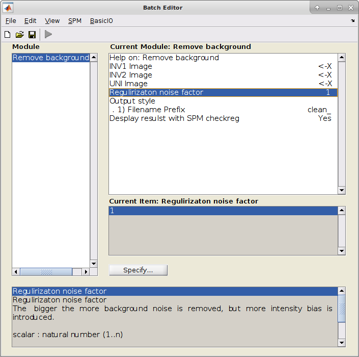
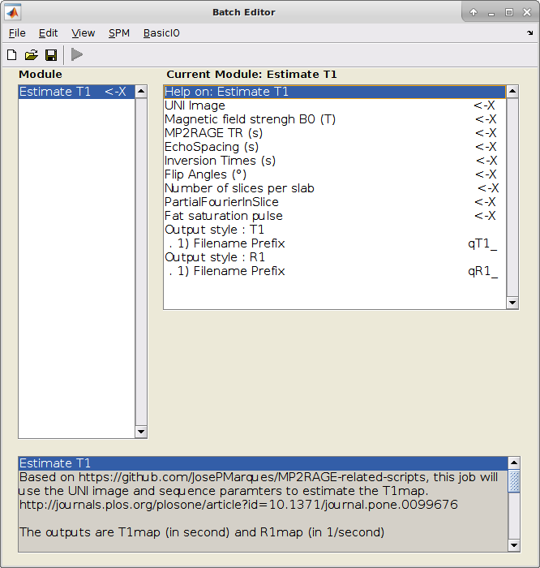
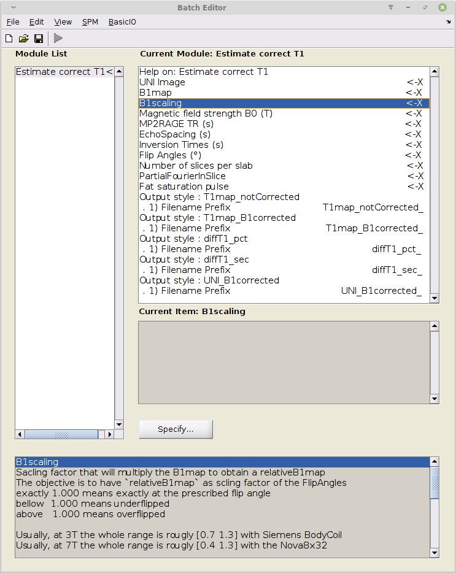
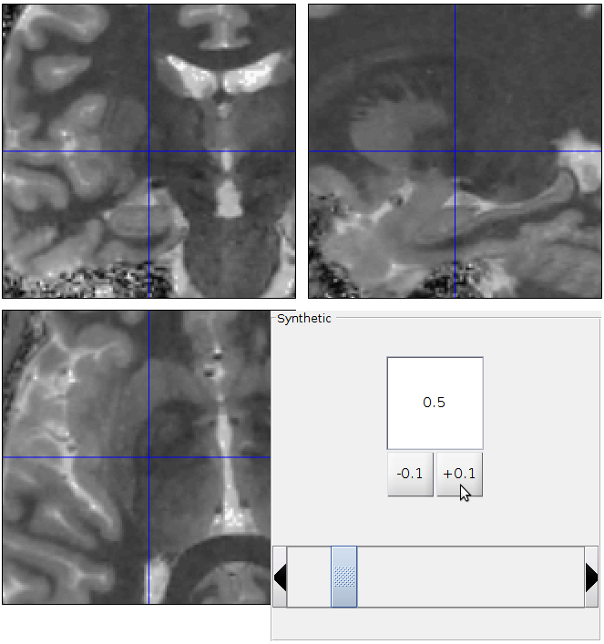

# mp2rage
SPM implementation of https://github.com/JosePMarques/MP2RAGE-related-scripts  
Based on:
* O'Brien KR, Kober T, Hagmann P, Maeder P, Marques J, Lazeyras F, et al. (2014) Robust T1-Weighted Structural Brain Imaging and Morphometry at 7T Using MP2RAGE. PLoS ONE 9(6): e99676. https://doi.org/10.1371/journal.pone.0099676
* O'Brien K, Krueger G, Lazeyras F, Gruetter R, Roche A, A simple method to denoise MP2RAGE; 2013; Salt Lake City, Utah.pp. 269. http://archive.ismrm.org/2013/0269.html
* Marques, J. P., Kober, T., Krueger, G., van der Zwaag, W., Van de Moortele, P.-F., & Gruetter, R. (2010). MP2RAGE, a self bias-field corrected sequence for improved segmentation and T1-mapping at high field. NeuroImage, 49(2), 1271–1281. https://doi.org/10.1016/j.neuroimage.2009.10.002

B1 corrected T1:
* Massire, A., Seiler, C., Troalen, T., Girard, O.M., Lehmann, P., Brun, G., Bartoli, A., Audoin, B., Bartolomei, F., Pelletier, J., Callot, V., Kober, T., Ranjeva, J.-P. and Guye, M. (2021) “T1-Based Synthetic Magnetic Resonance Contrasts Improve Multiple Sclerosis and Focal Epilepsy Imaging at 7 T,” Investigative Radiology, 56(2), pp. 127–133. Available at: https://doi.org/10.1097/RLI.0000000000000718on

## Requirements
SPM12: https://www.fil.ion.ucl.ac.uk/spm/software/spm12/

## Installation
Clone the repo: `git clone https://github.com/benoitberanger/mp2rage`,
or use direct download link [>> here <<](https://github.com/benoitberanger/mp2rage/archive/master.zip),
then place freshly downloaded/cloned directory in `spm12/toolbox/`, such as `spm12/toolbox/mp2rage`.
You can also use a symlink, such as `ln -s path/to/mp2rage path/to/spm12/toolbox/mp2rage`

That's all.

If you already started SPM in your MATLAB session, don't forget to refresh SPM paths with `spm_jobman('initcfg');`.

## How it works
This repo is an extension of _spm12_, you can use the Batch Editor (`spm_jobman`) and open the tab SPM > Tools > MP2RAGE > choose-your-job

### Remove background
The objective is to remove the "salt and pepper" background noise from the UNI image.  

#### Method 1 (newer)
Use a INV2 as pseudo mask. No user tuning required.  
Based on: https://github.com/srikash/3dMPRAGEise.git

#### Method 2 (historical)
Use a INV1 + INV2 + regularisation factor. The regularisation factor has to be tuned by the user.  
Based on:
* O'Brien KR, Kober T, Hagmann P, Maeder P, Marques J, Lazeyras F, et al. (2014) Robust T1-Weighted Structural Brain Imaging and Morphometry at 7T Using MP2RAGE. PLoS ONE 9(6): e99676. https://doi.org/10.1371/journal.pone.0099676
* O'Brien K, Krueger G, Lazeyras F, Gruetter R, Roche A, A simple method to denoise MP2RAGE; 2013; Salt Lake City, Utah.pp. 269. http://archive.ismrm.org/2013/0269.html

#### Interactive
To determine which regularization factor to use, you can use the job SPM > Tools > MP2RAGE > Interactive remove background  
This will display the original UNI image and the denoised version with a popup where you can enter the regularization level and check the result immediately:

#### Normal
When you are settled with your regularization level, use "normal" job SPM > Tools > MP2RAGE > Remove background:

### Estimate T1
This job will estimate T1map and R1map using sequence parameters and the UNI image.  
Based on:
* Marques, J. P., Kober, T., Krueger, G., van der Zwaag, W., Van de Moortele, P.-F., & Gruetter, R. (2010). MP2RAGE, a self bias-field corrected sequence for improved segmentation and T1-mapping at high field. NeuroImage, 49(2), 1271–1281. https://doi.org/10.1016/j.neuroimage.2009.10.002

### Estimate correct T1
B1 corrected estimation of the T1map.  Same inputs as `Estimate T1` + B1map and B1 scaling factor (depends on your sequence).  
Images generated:
- T1map uncorrected -> same as `Estimate T1`
- T1map **with** B1 correction
- Difference of T1map _after_ vs. _before_ B1 correction
  - in percentage (%)
  - in seconds (s)
- UNI **with** B1 correction

Based on:
* Marques, J. P., Kober, T., Krueger, G., van der Zwaag, W., Van de Moortele, P.-F., & Gruetter, R. (2010). MP2RAGE, a self bias-field corrected sequence for improved segmentation and T1-mapping at high field. NeuroImage, 49(2), 1271–1281. https://doi.org/10.1016/j.neuroimage.2009.10.002
* Massire, A., Seiler, C., Troalen, T., Girard, O.M., Lehmann, P., Brun, G., Bartoli, A., Audoin, B., Bartolomei, F., Pelletier, J., Callot, V., Kober, T., Ranjeva, J.-P. and Guye, M. (2021) “T1-Based Synthetic Magnetic Resonance Contrasts Improve Multiple Sclerosis and Focal Epilepsy Imaging at 7 T,” Investigative Radiology, 56(2), pp. 127–133. Available at: https://doi.org/10.1097/RLI.0000000000000718

### Synthetic image using T1map and InversionTime (TI)

#### Comments on the parameters
| Parameter name                 | Description                           | dcm2niix json sidecar field   | on Siemens scanners                                |
|--------------------------------|---------------------------------------|-------------------------------|----------------------------------------------------|
| UNI image                      | input T1 weighted                     |                x              | this image has the suffix `\_UNI_image`            |
| Magnetic field strength B0 (T) | in Tesla (T)                          | MagneticFieldStrength         |                           x                        |
| MR2RAGE TR (s)                 | Repetition time (TR) of the MP2RAGE   | RepetitionTime                | TR                                                 |
| EchoSpacing (s)                | in seconds (s), TR of the GRE readout | **does not exist**            | tab Sequence > Part 1 > Echos pacing               |
| Inversin Times (s)             | in seconds (s), such as `[TI1 TI2]`   | InversionTime                 | TI                                                 |
| Flip Angles (°)                | in degree (°), such as `[FA1 FA2]`    | FlipAngle                     | Flip angle                                         |
| Number of slices per slab      | Number of slices per slab             | **does not exist**            | Slices per slab                                    |
| PartialFourierInSlice          | The value range is 0 to 1             | PartialFourier                | **SlicePartialFourier**, not PhasePartialFourier   expressed as a fraction such as 8/8, 7/8, ... | 
| Fat saturation pulse           |                    x                  | **does not exist**            | tab Contrast > Fat Sat   the option can be "nonce, "water excitation normal", "water excitation fast" |
